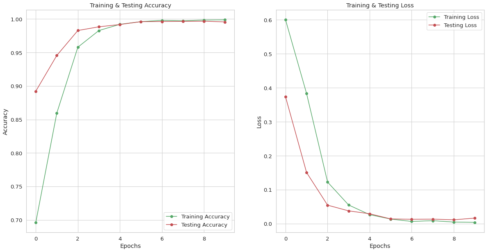
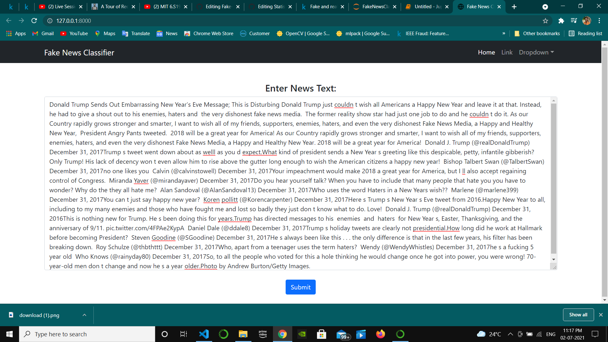
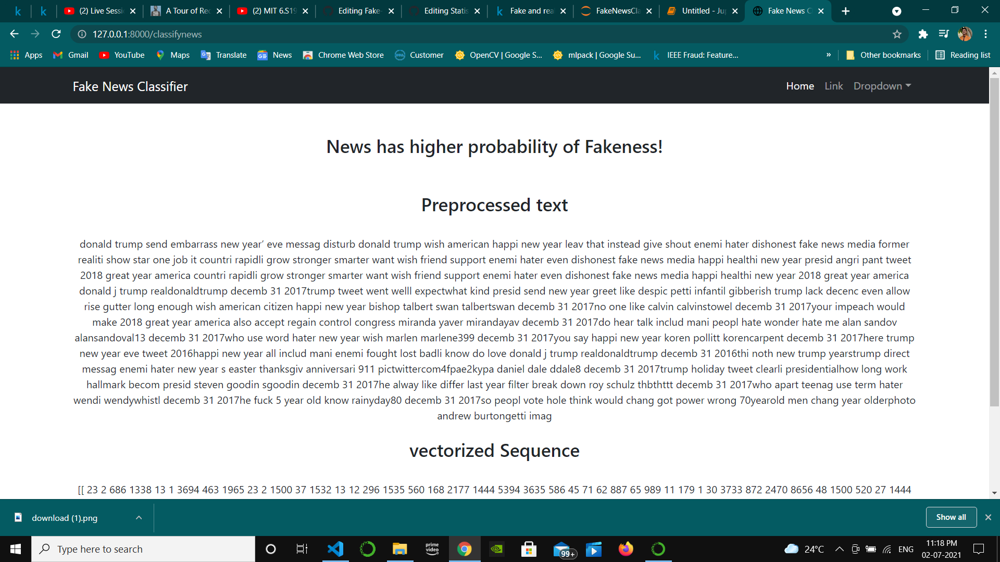
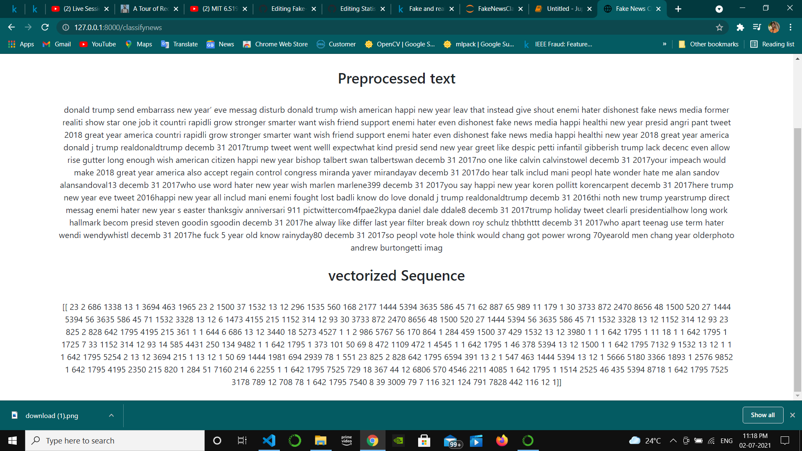

# Fake-News-Classifier
Implemented the fake news classifier using Django as a server-side framework and Html,  CSS, Bootstrap as a frontend technology. The Deep Learning model included an Embedding  layer and Long Short-Term Memory layers which provide complete sentiment of the  sentence. The system accepts text news as an input and predicts the probability of news being  True or fake.

#### Dataset used to train LSTM Neural network is Fake and real news dataset.
#### Link for the Dataset: https://www.kaggle.com/clmentbisaillon/fake-and-real-news-dataset/code?datasetId=572515&sortBy=voteCount

#### Model was trained with 99.5% validation accuracy.

#### Text preprocessing, Deep Learning model defination, and prediction code is in mscnn/views.py file

#### Accepting News text as Input

#### Fake News prediction

#### Preprocessed and Vectorized text

